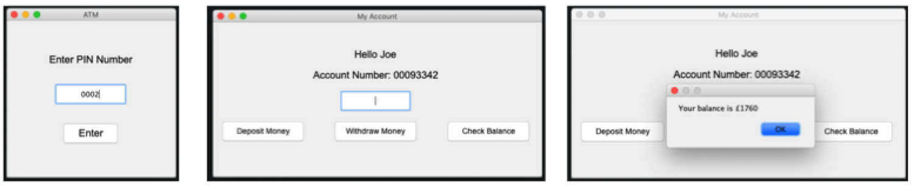

# ATM

This is my version of the popular ATM exercise written in Java. The development of the frontend GUI is written using JSwing and user account details are stored using MySQL. The application is intended purely as an learning exercise and represents a very simple adaptation of an ATM. Further work needs to be carried out in order to address issues concerning refactoring, PIN security and MySQL encryption.

# Features & Screenshots
* ATM desktop application 
* Developed using Java, JSwing & MySQL
* Access to user accounts through PIN number login 
* Users can deposit/withdraw finances or check account balance details

